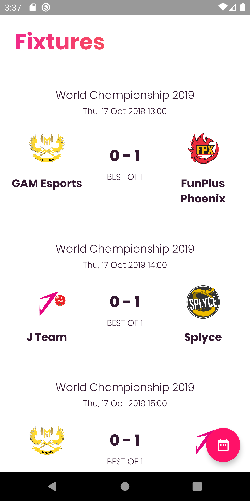
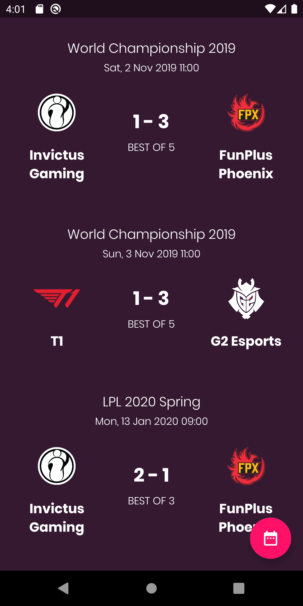
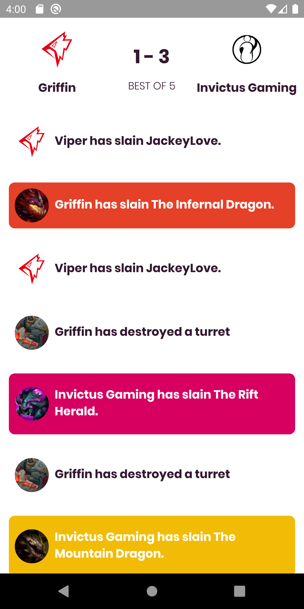
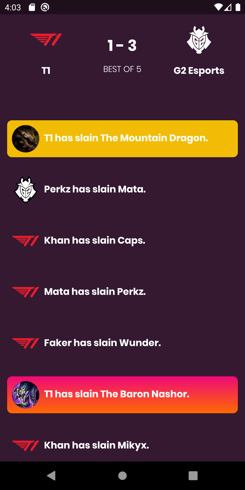

# League of Legends WebSockets Match Events
Demo App that shows League of Legends  match real time events.
This Demo uses [GameScoreKeeper Sockets Api](https://gamescorekeeper.com/)  for getting all live data.

|  |  |
|--|--|

## Libs
- [Koin:](https://insert-koin.io/) Dependence injection
- [Fresco:](https://github.com/facebook/fresco)  Images managment
- [Retrofit with coroutines adapter:](https://github.com/square/retrofit) Networking managment
- [Scarlet](https://github.com/Tinder/Scarlet) WebSockets managment

This project is based in [Android Jetpack](https://developer.android.com/jetpack?hl=es-419) using MVVM patterns, LiveData and ViewModel

It also supports Android Dark and Light mode using MaterialComponents

|  |  |
|--|--|
|  |  |
